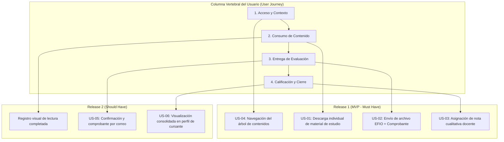
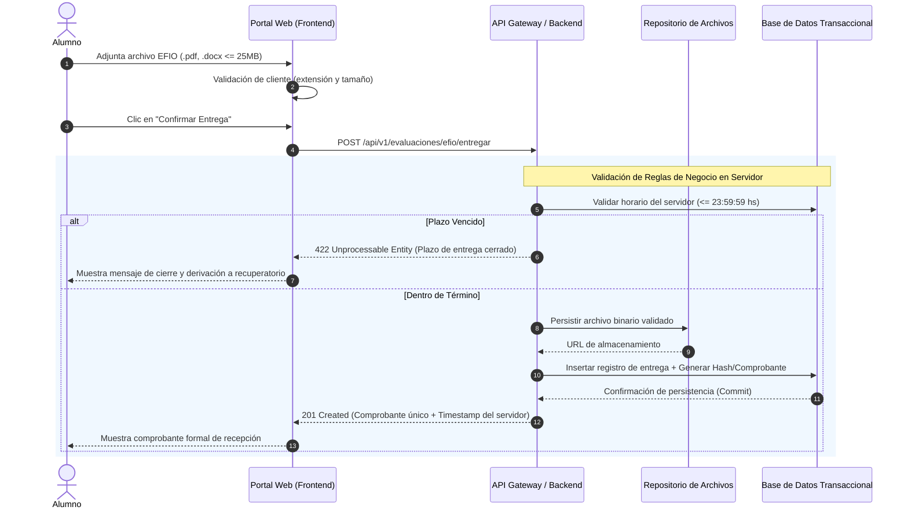
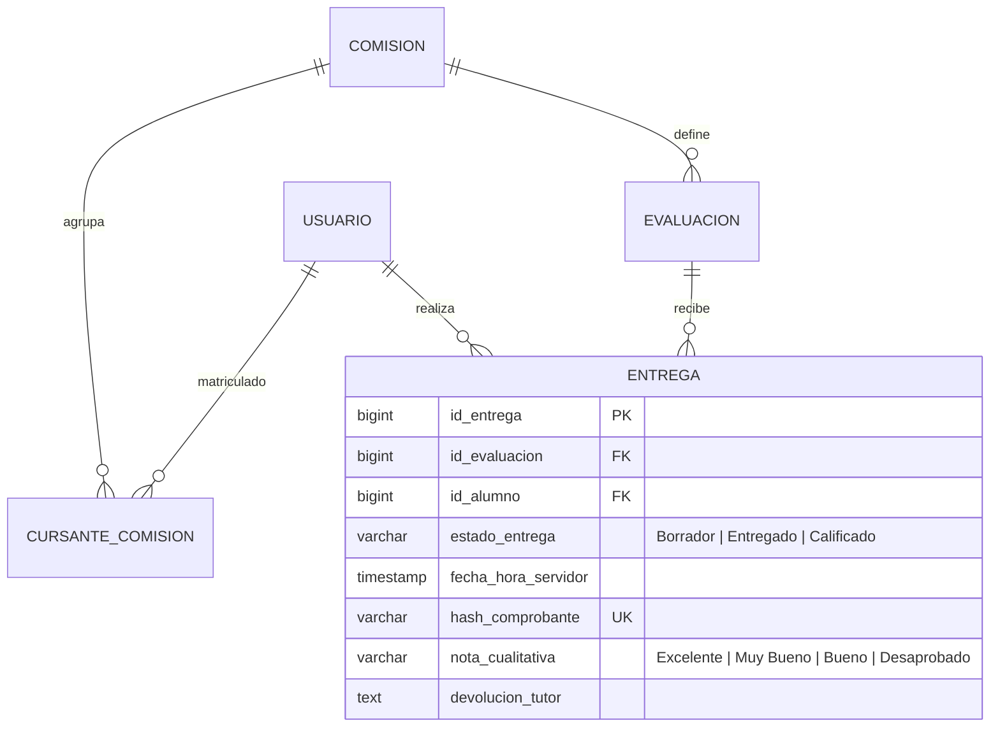

# Plataforma Educativa Virtual — Especificación Funcional & Arquitectura de Requerimientos

> **Caso de Estudio Profesional de Ingeniería de Requerimientos y Análisis Funcional**  
> Especificación técnica y de producto enfocada en la mitigación de cuellos de botella operativos en periodos críticos de evaluación[cite: 4, 11], trazabilidad transaccional y diseño de flujos de autoservicio académico[cite: 4].

---

## 1. Visión del Producto y Problema de Negocio

### El Problema
Las instituciones de educación superior a distancia experimentan una saturación de sus canales de soporte durante los cierres de cursada, generada por:
* Disputas sobre entregas de trabajos no registradas o fuera de término[cite: 4].
* Inestabilidad del sistema por picos de concurrencia en la última hora de entrega[cite: 4, 11].
* Tiempos excesivos en la consolidación manual de calificaciones para el cierre de actas[cite: 11].

### Propósito y Métricas de Negocio (KPIs)
El objetivo de la plataforma es **garantizar la validez transaccional y la transparencia del proceso evaluativo**[cite: 4]:
* **Trazabilidad inmutable:** 100% de entregas respaldadas con comprobante digital y marca temporal de servidor auditada[cite: 4].
* **Reducción de tickets de soporte en un 65%** asociados a reclamos de recepción de evaluaciones[cite: 4].
* **Disminución del Lead Time de Calificación:** Reducción a menos de 72 horas mediante consolidación centralizada de devoluciones en el panel docente[cite: 4, 11].

---

## 2. Alcance Funcional y Fuera de Alcance

| Módulo Funcional | En Alcance (MVP) | Fuera de Alcance |
| :--- | :--- | :--- |
| **Gestión de Contenidos**[cite: 4] | Navegación jerárquica por unidades[cite: 4], control de disponibilidad por fecha[cite: 8] y descarga individual de apuntes (.pdf, .docx, .zip)[cite: 4]. | Editor en línea de documentos[cite: 7] y descarga masiva de la totalidad de unidades en un único archivo[cite: 4, 7]. |
| **Evaluaciones (EFIO)**[cite: 4, 9] | Recepción con bloqueo estricto a las 23:59 hs[cite: 4, 9], validación de formato/peso (máx. 25 MB)[cite: 5, 9] y emisión de comprobante digital único con timestamp de servidor[cite: 4, 9]. | Corrección automatizada mediante modelos de inteligencia artificial[cite: 4, 9]. |
| **Calificaciones**[cite: 4, 9] | Panel de corrección con escala cualitativa oficial (Excelente, Muy Bueno, Bueno, Desaprobado)[cite: 4, 9] y feedback pedagógico obligatorio[cite: 4, 9, 10]. | Emisión y firma digital de diplomas o actas finales de titulación[cite: 4, 9, 10]. |
| **Interacción**[cite: 4, 5] | Foros temáticos asíncronos con hilos de debate y respuestas anidadas por unidad[cite: 4, 5]. | Salas de chat síncronas o videollamadas integradas[cite: 4]. |

---

## 3. User Story Mapping & Priorización (MoSCoW)

El backlog fue priorizado mediante técnica **MoSCoW**[cite: 5, 6], asegurando que el Release 1 entregue el flujo transaccional de punta a punta requerido para habilitar el ciclo lectivo[cite: 5, 6]:



---

## 4. Flujo de Negocio Crítico: Recepción y Bloqueo de Evaluaciones

Diagrama de secuencia que modela el control de concurrencia, la validación de reglas de negocio en servidor y la persistencia transaccional[cite: 9, 11]:



---

## 5. Especificaciones Funcionales & Criterios BDD (Gherkin)

### US-02: Envío de Evaluación Final Integradora Obligatoria (EFIO)[cite: 9]
* **Como** alumno cursante regular[cite: 9],  
* **Necesito** subir y enviar mi archivo de trabajo final antes de la fecha límite[cite: 9],  
* **Para** que sea corregido por el cuerpo docente y acreditar la regularidad del curso[cite: 9].

```gherkin
Funcionalidad: Recepción formal de Evaluaciones Finales Integradoras (EFIO)

  Antecedentes:
    Dado que el estudiante cursa la comisión y se encuentra dentro de la fecha habilitada

  Escenario: Envío exitoso dentro del plazo habilitado
    Dado que la hora actual del servidor es menor o igual a las 23:59 del día de cierre
    Cuando el alumno adjunta un documento en formato ".pdf" con un peso menor a 25 MB
    Y presiona el botón "Confirmar Entrega"
    Entonces el sistema persiste el archivo en el repositorio seguro
    Y cambia el estado de la entrega a "Entregado"
    Y emite en pantalla el número de comprobante único con marca temporal de servidor
    Y envía una copia de respaldo por correo electrónico.

  Esquema del escenario: Bloqueo de carga por formato inválido o tamaño excedido
    Cuando el alumno intenta adjuntar un archivo con nombre "<nombre_archivo>" y tamaño "<tamano>"
    Entonces el sistema bloquea la carga en el formulario
    Y notifica: "Formato no permitido o tamaño superior al límite de 25 MB".

    Ejemplos:
      | nombre_archivo    | tamano | resultado |
      | evaluacion.exe    | 5 MB   | Bloqueado |
      | caso_practico.zip | 30 MB  | Bloqueado |
      | script.bat        | 500 KB | Bloqueado |
```

---

## 6. Modelo de Datos Lógico y Contratos de Integración (APIs)

### Diagrama Entidad-Relación Lógico (ERD)
Representación de las entidades transaccionales y de seguimiento del sistema educativo[cite: 5, 8, 9, 10]:



### Contrato de API (REST Payload)[cite: 9]

#### `POST /api/v1/evaluaciones/efio/entregar`[cite: 9]
* **Request Payload (multipart/form-data):**[cite: 9]
```json
{
  "comision_id": 4012,
  "evaluacion_id": 8841,
  "alumno_id": 10592,
  "comentarios_alumno": "Entrega trabajo integrador final.",
  "archivo": "[binary_data]"
}
```

* **Response Payload (201 Created):**[cite: 9]
```json
{
  "transaccion_id": "trx-99381-utn",
  "codigo_comprobante": "CONST-2026-EFIO-8841",
  "estado": "ENTREGADO",
  "fecha_hora_recepcion": "2026-10-02T23:48:12.140-03:00",
  "archivo": {
    "nombre_original": "Pusillico_Daniel_EFIO.pdf",
    "hash_sha256": "e3b0c44298fc1c149afbf4c8996fb92427ae41e4649b934ca495991b7852b855",
    "tamano_bytes": 14680064
  }
}
```

---

## 7. Gestión de Riesgos Técnicos y Funcionales

| ID | Riesgo Funcional / Técnico | Impacto | Nivel | Estrategia de Mitigación Operativa |
| :--- | :--- | :---: | :---: | :--- |
| **R-01**[cite: 11] | Caída o lentitud de base de datos por picos masivos de tráfico en la hora previa al cierre de la EFIO[cite: 11]. | Alto[cite: 11] | **Crítico**[cite: 11] | Desacoplamiento de la subida de binarios directo a storage cloud mediante URLs prefirmadas, persistiendo solo la metadata transaccional en base de datos[cite: 11]. |
| **R-02**[cite: 11] | Subida de archivos dañados o con software malicioso por parte de cursantes[cite: 11]. | Alto[cite: 11] | **Alto**[cite: 11] | Validación estricta de extensiones permitidas (.pdf, .docx, .zip) y escaneo antivirus asíncrono previo a la disponibilidad para descarga docente[cite: 11]. |
| **R-03**[cite: 11] | Demora de tutores en asentar notas y devoluciones, retrasando el cierre de actas[cite: 11]. | Medio[cite: 11] | **Medio**[cite: 11] | Alertas automáticas por email 48 hs antes del vencimiento y tablero de seguimiento en tiempo real para coordinación académica[cite: 11]. |

---

## Autor
**Daniel Nicolás Pusillico**[cite: 1, 4]  
*Analista Funcional \| Business Systems Analyst \| SQL & Data Solutions*[cite: 1, 2]  
[LinkedIn](https://www.linkedin.com/in/danielpusillico)[cite: 2]
