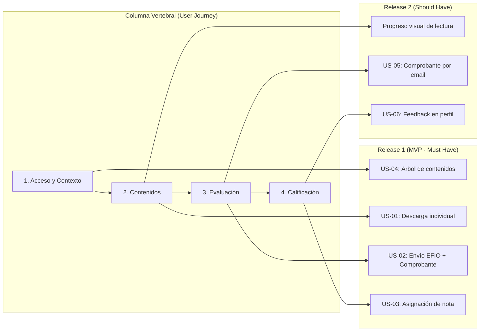
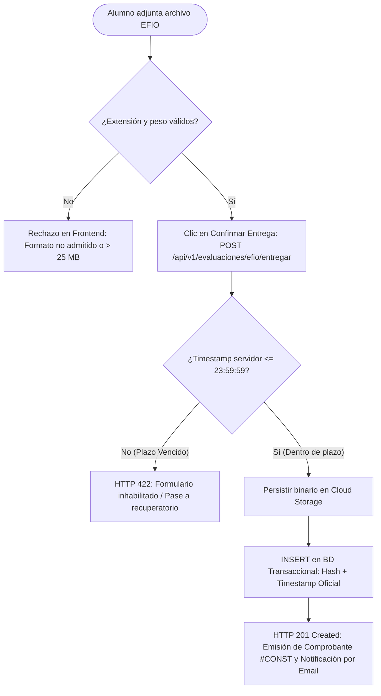
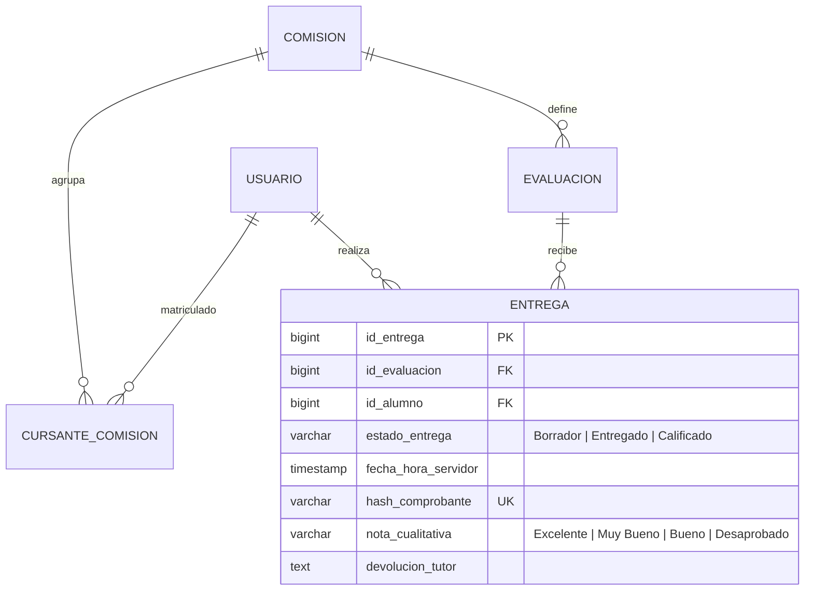

# Plataforma Educativa Virtual — Especificación Funcional & Arquitectura de Requerimientos

> **Caso de Estudio Profesional de Ingeniería de Requerimientos y Análisis Funcional**  
> Especificación técnica y funcional orientada a mitigar cuellos de botella operativos en periodos críticos de evaluación, asegurar trazabilidad transaccional y optimizar el autoservicio académico.

---

## 1. Visión del Producto y Problema de Negocio

### El Problema
Las instituciones de educación superior a distancia experimentan una saturación crítica de sus canales de soporte durante los periodos de cierre de cursada, provocada por:
* Disputas sobre entregas de trabajos no registradas o presentadas fuera de término.
* Inestabilidad del sistema por picos masivos de concurrencia en la última hora de entrega.
* Tiempos excesivos en la consolidación manual de calificaciones para el cierre de actas académicas.

### Propósito y Métricas de Impacto (KPIs)
El objetivo de la plataforma es **garantizar la validez transaccional y la transparencia del proceso evaluativo**:
* **Trazabilidad inmutable:** 100% de las entregas respaldadas con comprobante digital y marca temporal de servidor auditada.
* **Reducción del 65% en tickets de soporte** asociados a reclamos por recepción de evaluaciones.
* **Disminución del Lead Time de Calificación:** Reducción a menos de 72 horas mediante un panel centralizado de corrección y feedback.

---

## 2. Alcance Funcional y Fuera de Alcance

| Módulo Funcional | En Alcance (MVP) | Fuera de Alcance |
| :--- | :--- | :--- |
| **Gestión de Contenidos** | Navegación jerárquica por unidades, control de disponibilidad por fecha y descarga individual de apuntes (.pdf, .docx, .zip). | Editor en línea de documentos y descarga masiva de la totalidad de unidades en un único archivo comprimido. |
| **Evaluaciones (EFIO)** | Recepción con bloqueo estricto a las 23:59 hs, validación de formato/peso (máx. 25 MB) y emisión de comprobante digital único con timestamp de servidor. | Corrección automatizada mediante modelos de inteligencia artificial. |
| **Calificaciones** | Panel de corrección con escala cualitativa oficial (Excelente, Muy Bueno, Bueno, Desaprobado) y feedback pedagógico obligatorio. | Emisión y firma digital de diplomas o actas finales de titulación. |
| **Interacción** | Foros temáticos asíncronos con hilos de debate y respuestas anidadas por unidad. | Salas de chat síncronas o videollamadas integradas. |

---

## 3. User Story Mapping & Priorización (MoSCoW)

El backlog fue estructurado sobre el flujo del usuario y priorizado mediante técnica **MoSCoW**, asegurando un Release 1 funcional de punta a punta:



---

## 4. Flujo de Negocio Crítico: Recepción y Bloqueo de Evaluaciones

Diagrama de decisión funcional que modela el control de concurrencia, las validaciones de servidor y la persistencia transaccional:



---

## 5. Especificaciones Funcionales & Criterios BDD (Gherkin)

### US-02: Envío de Evaluación Final Integradora Obligatoria (EFIO)
* **Como** alumno cursante regular,  
* **Necesito** subir y enviar mi archivo de trabajo final antes de la fecha límite,  
* **Para** que sea corregido por el cuerpo docente y acreditar la regularidad del curso.

```gherkin
Funcionalidad: Recepción formal de Evaluaciones Finales Integradoras (EFIO)

  Antecedentes:
    Dado que el estudiante cursa la comisión y se encuentra dentro de la fecha habilitada

  Escenario: Envío exitoso dentro del plazo habilitado
    Dado que la hora actual del servidor es menor o igual a las 23:59:59 del día de cierre
    Cuando el alumno adjunta un documento en formato ".pdf" con un peso menor a 25 MB
    Y presiona el botón "Confirmar Entrega"
    Entonces el sistema persiste el archivo en el repositorio seguro
    Y cambia el estado de la entrega a "Entregado"
    Y emite en pantalla el número de comprobante único con marca temporal de servidor
    Y despacha una copia de respaldo por correo electrónico.

  Esquema del escenario: Bloqueo de carga por formato inválido o tamaño excedido
    Cuando el alumno intenta adjuntar un archivo con nombre "<nombre_archivo>" y tamaño "<tamano>"
    Entonces el sistema bloquea la carga en el formulario
    Y notifica: "Formato no permitido o tamaño superior al límite de 25 MB".

    Ejemplos:
      | nombre_archivo    | tamano | resultado |
      | evaluacion.exe    | 5 MB   | Bloqueado |
      | caso_practico.zip | 30 MB  | Bloqueado |
      | script.bat        | 500 KB | Bloqueado |
```

---

## 6. Modelo de Datos Lógico y Contratos de Integración (APIs)

### Diagrama Entidad-Relación Lógico (ERD)
Entidades funcionales que soportan el ciclo de vida de la evaluación y la trazabilidad de notas:



### Contrato de API (REST Specification)

#### `POST /api/v1/evaluaciones/efio/entregar`
* **Request Payload (multipart/form-data):**
```json
{
  "comision_id": 4012,
  "evaluacion_id": 8841,
  "alumno_id": 10592,
  "comentarios_alumno": "Entrega trabajo integrador final.",
  "archivo": "[binary_data]"
}
```

* **Response Payload (201 Created):**
```json
{
  "transaccion_id": "trx-99381-utn",
  "codigo_comprobante": "CONST-2026-EFIO-8841",
  "estado": "ENTREGADO",
  "fecha_hora_recepcion": "2026-10-02T23:48:12.140-03:00",
  "archivo": {
    "nombre_original": "Pusillico_Daniel_EFIO.pdf",
    "hash_sha256": "e3b0c44298fc1c149afbf4c8996fb92427ae41e4649b934ca495991b7852b855",
    "tamano_bytes": 14680064
  }
}
```

---

## 7. Gestión de Riesgos Técnicos y Funcionales

| ID | Riesgo Funcional / Técnico | Impacto | Nivel | Estrategia de Mitigación Operativa |
| :--- | :--- | :---: | :---: | :--- |
| **R-01** | Caída o lentitud de base de datos por picos masivos de tráfico en la hora previa al cierre de la EFIO. | Alto | **Crítico** | Desacoplamiento de subida directa a storage mediante URLs prefirmadas, persistiendo solo metadata transaccional en base de datos. |
| **R-02** | Subida de archivos dañados o con software malicioso por parte de cursantes. | Alto | **Alto** | Validación estricta de extensiones permitidas (.pdf, .docx, .zip) y análisis antivirus asíncrono previo a la descarga docente. |
| **R-03** | Demora de tutores en asentar notas y devoluciones, retrasando el cierre de actas. | Medio | **Medio** | Alertas automáticas 48 hs antes del vencimiento y tablero de seguimiento en tiempo real para coordinación académica. |

---

## Autor
**Daniel Nicolás Pusillico**  
*Analista Funcional | Business Systems Analyst | SQL & Data Solutions*  
[Perfil en LinkedIn](https://www.linkedin.com/in/danielpusillico)
